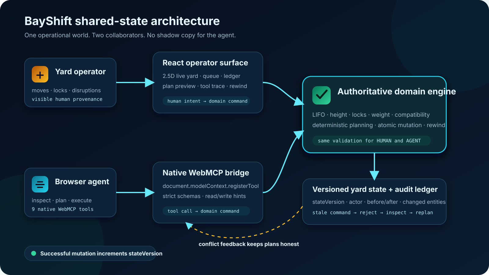

# BayShift

**A live container-yard workspace where a human operator and a browser agent can safely act on the same operational state.**

[Live app](https://bayshift-webmcp.vercel.app/) · [Demo video](https://youtu.be/Wj5XU4jRvPE) · [Native WebMCP test](docs/NATIVE_WEBMCP_TEST.md) · [Evaluation notes](docs/EVALS.md)

BayShift was built for the OpenAI WebMCP Challenge. It turns the yard itself into a shared working surface: operators can move containers, lock stacks, trigger disruptions, inspect changes, and rewind actions while an agent discovers structured tools for the same world.

This is not a chatbot bolted onto a dashboard. The human UI and the agent tool surface both call one deterministic logistics engine. There is no shadow copy of the yard and no second set of rules.

## Why WebMCP matters here

A container plan can become unsafe seconds after it is calculated. A human may lock a destination, a crane lane may go offline, or a higher-priority truck may arrive while the agent is still reasoning.

BayShift gives the agent native, typed capabilities to inspect, simulate, validate, execute, recover, and rewind. Destructive tools must include the exact `expectedStateVersion` observed during planning. When the yard changes first, the old command is rejected with `STALE_STATE`; the agent must inspect the difference and replan from reality.

```text
Agent inspects v37 → plans for v37 → human locks B01 → yard becomes v38
                 → old move rejected → inspect changes → replan safely
```

That creates a collaboration model ordinary page automation cannot provide: both sides can act, neither silently overwrites the other, and every accepted or rejected action remains visible.

## Architecture



- **React operator surface:** 2.5D yard, priority queue, plan preview, disruptions, tool trace, and rewind controls.
- **Native WebMCP bridge:** nine tools registered with `document.modelContext.registerTool`, strict JSON schemas, and read/write annotations.
- **Authoritative domain engine:** one implementation of LIFO, height, lock, outage, weight, compatibility, retrieval, and rewind rules for both actors.
- **Versioned state and audit ledger:** monotonic `stateVersion`, HUMAN/AGENT/SYSTEM provenance, before/after snapshots, changed entities, and structured conflict responses.

The implementation lives in:

- `src/domain/engine.ts` — validation, bounded planning, mutations, change inspection, and rewind.
- `src/domain/scenario.ts` — deterministic five-stack challenge scenarios.
- `src/webmcp/schemas.ts` — agent-facing tool contracts.
- `src/webmcp/bridge.ts` — native WebMCP registration and execution.
- `src/components/` — the shared visual workbench, agent dock, metrics, and ledger.

## WebMCP tool surface

| Tool | Mode | What it enables |
| --- | --- | --- |
| `inspect_yard` | Read | Read the current version, target, blockers, disruptions, and legal destinations |
| `get_container` | Read | Locate one container and return its live domain record |
| `analyze_blockers` | Read | Explain the physical blocker chain and immediate legal moves |
| `validate_move` | Read | Dry-run one relocation against all six yard rules |
| `simulate_relocations` | Read | Rank deterministic minimum-move plans without mutation |
| `execute_move` | Write | Apply one version-guarded relocation with AGENT provenance |
| `retrieve_target` | Write | Retrieve an exposed target at the inspected version |
| `inspect_changes` | Read | Return the auditable changes after a known version |
| `rewind_yard` | Write | Restore physical state while preserving monotonic history |

Failures are structured and never partially mutate the yard.

## Run locally

Requires Node.js 18 or newer.

```bash
npm install
npm run dev
```

Open `http://127.0.0.1:5173/`.

Run the complete verification suite:

```bash
npm test
npm run build
node scripts/verify_manual_flow.mjs
```

The repository includes 18 domain and WebMCP contract tests.

## Judge-ready walkthrough

1. Open the live app in ChatGPT's in-app browser or Chrome with WebMCP enabled.
2. Ask the agent to inspect the yard and identify the blockers above the priority target.
3. Ask it to simulate legal relocation plans without moving anything.
4. Change the yard from the human UI, then let the retained agent command fail safely with `STALE_STATE`.
5. Ask the agent to inspect changes, replan, and execute one move per fresh version.
6. Retrieve the exposed target, inspect the shared ledger, and rewind the physical action.

For exact tool inputs and expected responses, follow [docs/NATIVE_WEBMCP_TEST.md](docs/NATIVE_WEBMCP_TEST.md).

## Current scope

The challenge build is deployed and the complete native WebMCP flow has been exercised in a live browser: discovery, inspection, simulation, stale-command rejection, recovery planning, authoritative movement, retrieval, audit, and rewind.

The planner is deliberately bounded for the challenge-sized yard. State is client-local and resets on reload. The visual yard uses lightweight DOM/CSS 2.5D rendering to keep the production bundle responsive.

## License

Released under the [MIT License](LICENSE).
