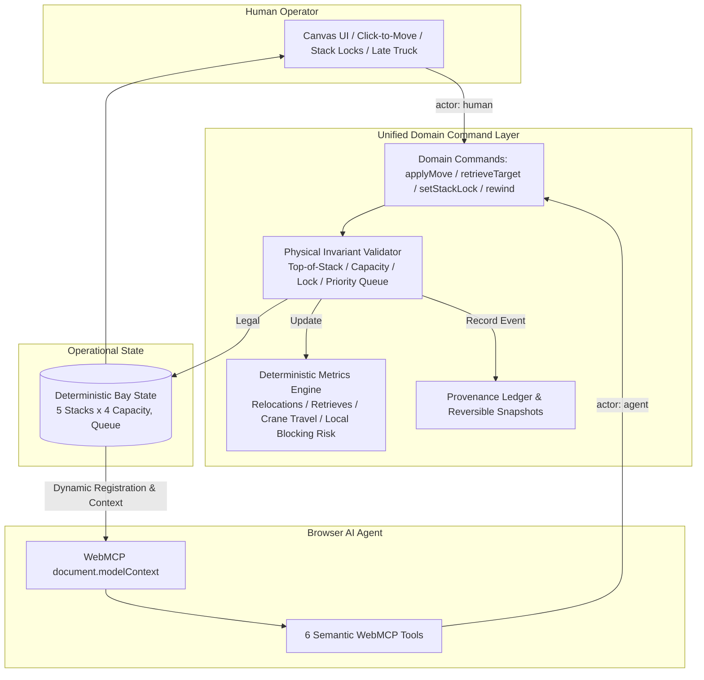

# BayShift &bull; Shared Container-Yard Relocation Canvas (WebMCP)

> **One-Sentence Product Thesis:**  
> A shared, deterministic container-terminal operational canvas where a human crane operator and an in-browser AI agent manipulate the **exact same live operational state** via WebMCP semantic tools (`document.modelContext`), maintaining strict physical invariants and verifiable actor provenance.

---

## The Operational Problem: The Container Relocation Problem (CRP)

In modern maritime container terminals, containers are stacked vertically to maximize scarce land area. Because rubber-tired gantry (RTG) cranes can only pick up the topmost container in any given stack, extracting a buried container scheduled for pickup requires **reshuffling** (relocating) all containers above it into neighboring stacks.

The Container Relocation Problem is a known **NP-hard** operational optimization problem. Poorly planned relocations create secondary blockages, waste crane travel time, and delay vessel turnaround.

In real operations, human operators face dynamic disruptions: emergency safety lane closures, equipment maintenance, or late truck arrivals that disrupt priority order. **BayShift** provides a shared operational environment where human operators and browser AI agents collaborate seamlessly on a live 5-stack bay.

---

## Why WebMCP Over DOM Actuation?

Traditional browser automation relies on DOM scraping, CSS selector clicks, and visual screen coordinates:
- **Fragile:** Responsive reflows, class name hashing, and rendering latency cause failed clicks and race conditions.
- **Blind:** DOM agents cannot reason about physical domain constraints (e.g., stack capacity, locked corridors, retrieval order) before actuating.
- **Unverifiable:** DOM clicks bypass business logic validation, risking corrupt states or silent failures.

**With WebMCP (`document.modelContext`):**
1. **Semantic Tools:** The agent interacts via typed JSON RPC interfaces (`inspect_yard`, `analyze_target`, `simulate_relocation`, `move_container`, `retrieve_target`, `rewind_last_action`).
2. **Pre-flight Simulation:** The agent can dry-run candidate relocations without mutating state, calculating crane travel distance and local blocking risk.
3. **Structured Error Recovery:** If an invariant is violated (e.g., trying to move into a locked stack), the engine returns a structured error code (`ERR_DEST_LOCKED`) along with legal alternatives.
4. **Dynamic Lifecycle:** Mutating capabilities like `retrieve_target` and `rewind_last_action` are dynamically registered only when physically valid in current bay state.

---

## WebMCP Semantic Tools Contract

BayShift registers a focused suite of semantic tools directly onto `document.modelContext`:

| Tool Name | Type | Input Schema | Description & Semantic Behavior |
|:---|:---:|:---|:---|
| `inspect_yard` | Read-only | `{}` | Returns complete bay state: current queue target, compact stack listings (heights, top containers, locks), metrics, and dynamic guidance. |
| `analyze_target` | Read-only | `{ containerId: string }` | Analyzes a specific container's position, depth from top, blockers above it, and legal destination stacks for the top blocker. |
| `simulate_relocation` | Read-only | `{ containerId: string, toStack: string }` | Validates proposed move legality without mutating state. Returns `allowed`, error code if invalid, crane travel steps, and delta blocking score. |
| `move_container` | Mutating | `{ containerId: string, fromStack: string, toStack: string, rationale?: string }` | Executes a physical move of the top container. Enforces top-of-stack, capacity, unlocked destination. Records `AGENT` provenance. |
| `retrieve_target` | Mutating *(Dynamic)* | `{ containerId: string }` | Dispatches crane to retrieve the priority container out of the bay. **Registered dynamically only when target is exposed at the top of its stack.** |
| `rewind_last_action` | Mutating *(Dynamic)* | `{ eventId?: string }` | Reverts the latest reversible action, restoring previous snapshot. **Registered dynamically only when a reversible history item exists.** |

*Note: `readOnlyHint` is applied to tool annotations for semantic agent alignment and is not treated as security authorization.*

---

## Architecture Diagram



---

## Human vs. Agent Contract

- **Single Shared State:** Both actors manipulate the same in-memory operational bay.
- **Unified Validation:** Neither human nor agent can bypass domain validation rules. If a stack is locked or full, both human clicks and agent tool calls are rejected with identical errors.
- **Provenance Accounting:** Every mutation records the actor identity (`human`, `agent`, or `system`), timestamp, rationale, and pre-action snapshot.
- **Human In-The-Loop Overrides:** The operator can lock any stack at will or trigger a &ldquo;Late truck update&rdquo; to disrupt priority schedules, prompting the agent to re-evaluate its plan.

---

## Local Development & Setup

### Prerequisites
- Node.js 18+ (tested on Node 20 / Node 24)
- npm or pnpm

### Quick Start
```bash
# Clone repository
git clone https://github.com/your-username/bayshift-webmcp.git
cd bayshift-webmcp

# Install dependencies
npm install

# Run automated Vitest test suite
npm test

# Run development server
npm run dev
```

Visit `http://localhost:5173` in your browser.

---

## Testing WebMCP in AI Browsers

### Option 1: Chrome with ModelContext Flag
1. Launch Google Chrome with WebMCP flags enabled:
   ```bash
   chrome --enable-features=ModelContextTesting,ModelContextAPI
   ```
2. Navigate to `http://localhost:5173` (or the deployed URL).
3. The top bar will display `WebMCP: Connected` in green.

### Option 2: ChatGPT In-App Browser
1. Deploy or tunnel the app via a public HTTPS URL (Vercel, Netlify, or ngrok).
2. Open the URL inside the ChatGPT browsing environment.
3. ChatGPT detects tools automatically on `document.modelContext` and presents actions directly.

### Option 3: Manual Mode & Embedded Tool Inspector
If WebMCP is not present in the current browser:
- The top-bar indicator reads `Manual Mode (WebMCP Unavailable)`.
- Click the **Tools** button in the top bar to open the **WebMCP Capability & Tool Inspector**.
- You can inspect all registered tools, schemas, and trigger simulated agent tool executions directly against the live state.

---

## Judge Walkthrough & 3 Copy-Paste Prompts

Click the **Judge Walkthrough** button in the top bar for interactive guidance or copy-paste these prompts into your agent:

### Prompt 1: Baseline Inspection & Blocker Analysis
```text
Inspect the yard and tell me what blocks C01, where it is located, and which stack is best to clear the top blocker to.
```
*Expected Behavior:* Agent calls `inspect_yard` and `analyze_target(containerId="C01")`. Reports C01 is in Stack B buried under C04 and C07 (top). Identifies Stack E as the best low-risk target (3 open slots).

### Prompt 2: Autonomous Clearance & Retrieval
```text
Clear C01 without using Stack D, then retrieve it.
```
*Expected Behavior:* Agent moves C07 to Stack E, moves C04 to Stack A, then dispatches `retrieve_target(containerId="C01")` as soon as it dynamically unlocks.

### Prompt 3: Invariant Violation & Error Recovery
```text
Move the top container from Stack B to locked Stack D.
```
*Expected Behavior:* Agent calls `move_container` to Stack D. Receives structured `ERR_DEST_LOCKED` rejection with open alternatives `["A", "C", "E"]`. Recovers without crashing by selecting an open stack.

---

## Deterministic Metrics

1. **Relocations:** Total count of non-productive container reshuffles.
2. **Target Retrieves:** Total count of successfully extracted target containers.
3. **Crane Travel Steps:** Sum of horizontal gantry travel: \(\sum |index_{from} - index_{to}|\).
4. **Local Blocking Risk Score:** Deterministic local heuristic measuring how many high-priority items are buried beneath lower-priority cargo.

---

## Safety, Rollback & Reversibility

- **Atomic Mutations:** Commands either completely succeed or fail cleanly with zero side-effects.
- **One-Step / Multi-Step Rewind:** All moves and retrievals store a deep `snapshotBefore`. The operator (or agent via `rewind_last_action`) can revert any reversible action instantaneously.
- **Audit Ledger:** Every action is preserved in the operations ledger with complete provenance badges.

---

## Deployment & Headers

Configured for static hosting on Vercel or Netlify with zero server dependencies:
- `Origin-Agent-Cluster: ?1`
- `Permissions-Policy: tools=(self)`

---

## Open Source License

Distributed under the [MIT License](LICENSE).
